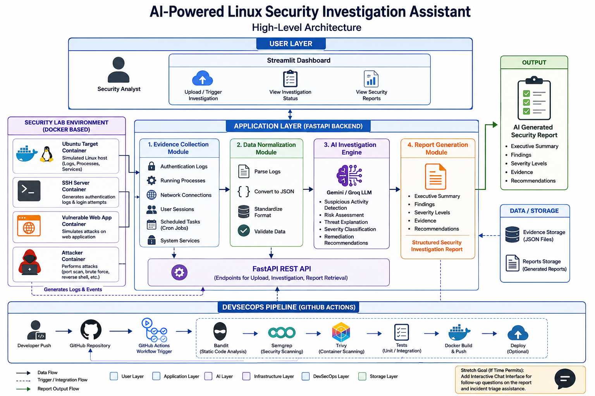
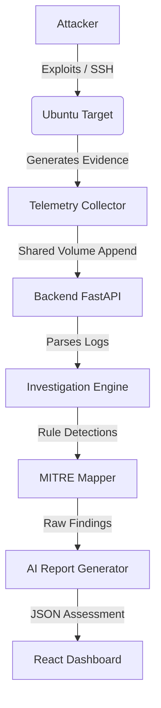
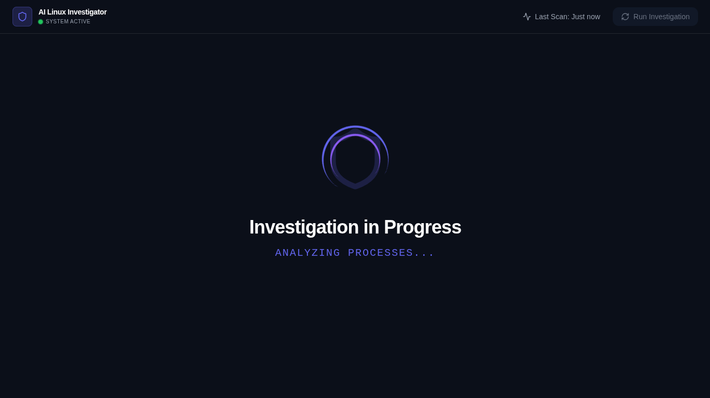
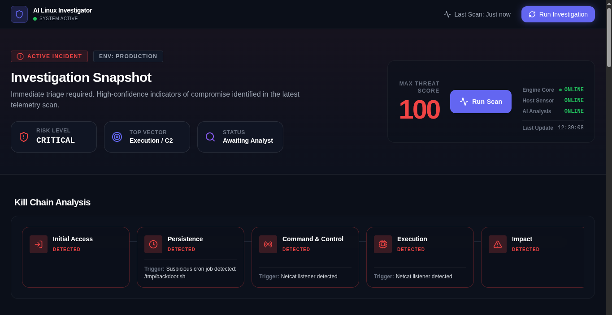
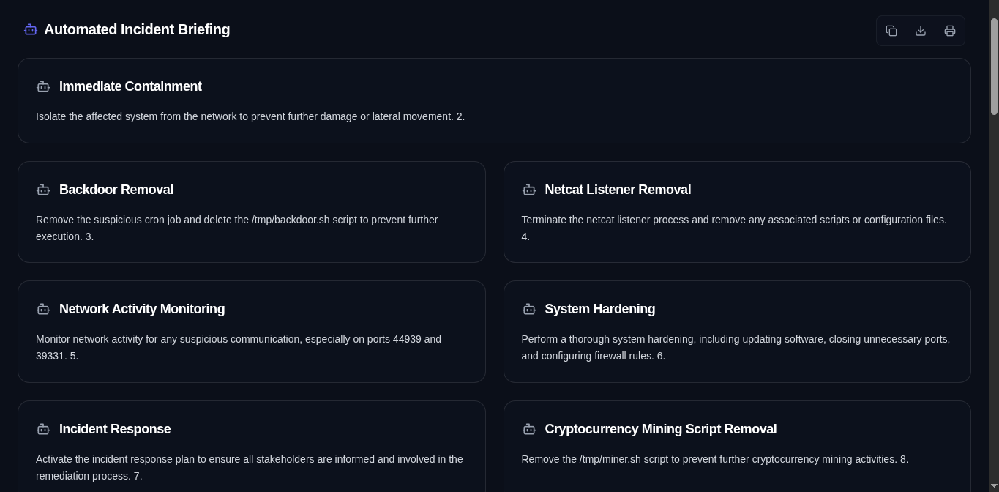
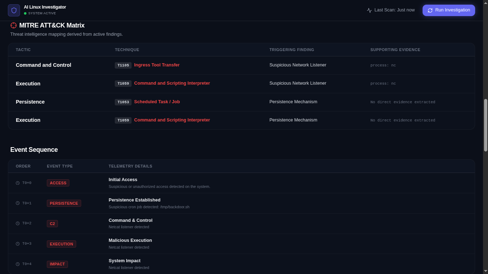
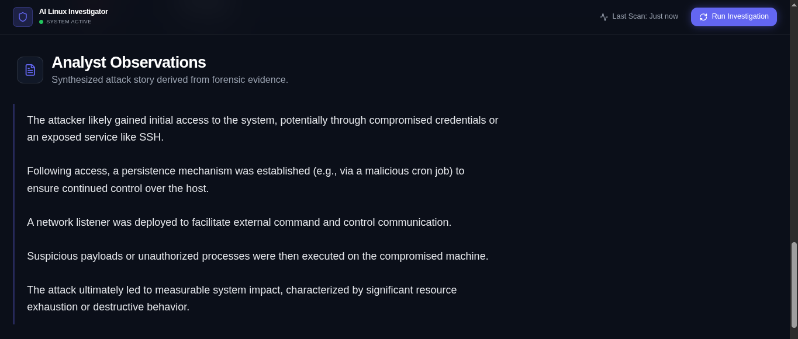
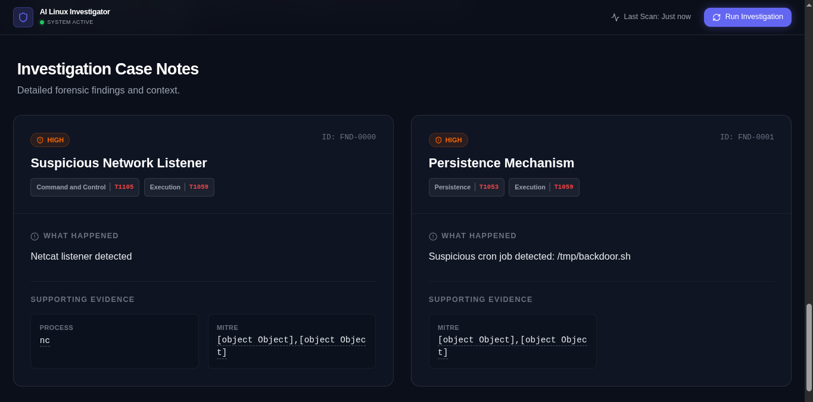
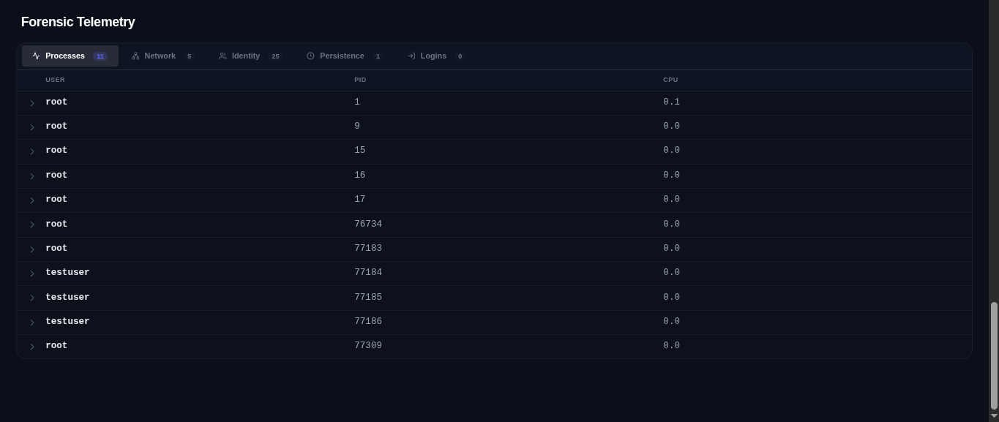

# AI Linux Investigator

**An AI-assisted Linux Forensics and Security Investigation Platform**


AI Linux Investigator is an open-source project developed during a cybersecurity internship (8 June 2026 – 27 June 2026). This repository demonstrates Linux forensic evidence collection, rule-based threat detection, MITRE ATT&CK mapping, AI-assisted incident analysis, Docker-based attack simulation, and secure DevSecOps software engineering practices.

The investigation engine functions independently using deterministic rule-based detection. AI is used only to assist analysts by generating investigation summaries, contextual explanations, and remediation recommendations.

---

## Project Status

✅ Internship Completed
✅ Active Development
✅ Documentation Complete
✅ GitHub Actions Pipeline Passing

---

## Repository Statistics

- **Backend:** FastAPI (Python)
- **Frontend:** React + Vite
- **Docker Images:** 4
- **GitHub Actions Pipeline:** 4 Security Gates
- **Daily Engineering Documentation:** Internship Progress Logs
- **Investigation Dashboard:** React SPA
- **MITRE ATT&CK Integration:** Implemented

---

## Skills Demonstrated

* Linux System Administration
* Linux Forensics
* Incident Response
* Digital Forensics
* Python
* FastAPI
* React
* Docker
* Docker Compose
* GitHub Actions
* DevSecOps
* Secure SDLC
* MITRE ATT&CK
* AI-assisted Security Investigation

---

## 🎯 Why I Built This

This project was developed during a cybersecurity internship. The primary goal was to combine Linux forensics, AI-assisted security investigation, Docker containerization, and DevSecOps into one comprehensive platform. 

The focus of this repository is on learning and implementing real-world security engineering practices, from secure SDLC pipelines to forensic telemetry collection.

---

## ⚠️ Disclaimer

This project is intended for educational, research, and cybersecurity training purposes.

All attack simulations are executed inside isolated Docker containers in a controlled laboratory environment. The project is not intended for use against systems without explicit authorization.

---

## 📋 Project Objectives

- **Collect Linux forensic telemetry** from a simulated target machine.
- **Normalize evidence** from raw bash output into structured JSON.
- **Detect suspicious behavior** using deterministic rule-based analyzers.
- **Map findings to MITRE ATT&CK** tactics and techniques.
- **Generate AI-assisted investigation reports** to assist analysts.
- **Present findings** through an interactive React dashboard.
- **Secure the SDLC** using a strict DevSecOps pipeline (Bandit, Semgrep, Trivy, Gitleaks).

---

## ⭐ Repository Highlights

- Docker-based Linux investigation lab
- AI-assisted security investigation reports
- MITRE ATT&CK mapping
- FastAPI backend
- React dashboard
- Automated telemetry collection
- DevSecOps CI/CD pipeline
- Multi-stage hardened Docker images
- Security scanning with Bandit, Semgrep, Trivy, and Gitleaks

---

## 🎥 Demo

The screenshots below demonstrate the complete investigation workflow, from attack simulation and telemetry collection to AI-assisted incident analysis and visualization.

See the **Application Walkthrough** section for the complete interface walkthrough.

---

## ⚡ Features

### Investigation Engine
* **Evidence Collection:** Retrieves structured system state data.
* **Rule-Based Detection:** Flags indicators such as excessive CPU utilization and suspicious reverse shells using deterministic logic.
* **AI-Assisted Security Investigation:** AI assists analysts by explaining findings, generating summaries, and suggesting remediation.
* **Risk Scoring:** Computes an overall security posture score based on active threats.

### Linux Telemetry
* **Processes:** Captures running binaries, CPU/RAM utilization, and PIDs.
* **Network:** Maps active listeners, established connections, and binding interfaces.
* **Login Activity:** Reconstructs historical authentication events.
* **Users:** Enumerates local system accounts.
* **Cron Jobs:** Identifies scheduled tasks and potential persistence mechanisms.

### Intelligence
* **MITRE ATT&CK Mapping:** Translates rule-based findings into standardized tactics and techniques.
* **Threat Correlation:** Links extracted findings back to their raw telemetry artifacts.
* **Investigation Timeline:** Displays chronological sequences of system events.
* **AI Summary:** AI assists analysts by generating executive-level explanations and tailored remediation guidance.

### Frontend
* **React Dashboard:** A clean UI built for navigating investigation data.
* **Findings Explorer:** An interface for filtering and reviewing security flags.
* **Attack Chain:** Visual module highlighting the stages of the attack progression.
* **MITRE Matrix:** Visual layout of detected techniques.

### Infrastructure & DevSecOps
* **Docker Lab:** A dedicated, isolated environment consisting of an attacker and a target.
* **Historical Telemetry:** Append-only log files providing forensic snapshots.
* **Shared Volume Architecture:** Securely passes logs from the lab to the platform without privileged socket mounts.
* **GitHub Actions:** CI/CD automation on every push/PR with strict quality and security gating.

---

## Key Design Decisions

* **Shared Docker volumes** instead of Docker socket mounting to prevent container escape vulnerabilities.
* **Separation of deterministic rule-based detection from AI-assisted reasoning** to ensure accurate alerts without hallucinations.
* **Multi-stage Docker builds** to minimize runtime images and reduce attack surface.
* **Non-root containers** for improved container security and least-privilege execution.
* **Append-only telemetry** to preserve forensic evidence and prevent tampering.

---

## Validation

The project has been successfully validated through:

* Docker integration testing
* GitHub Actions CI/CD
* Bandit (Python SAST)
* Semgrep (Polyglot SAST)
* Trivy (Container Vulnerability Scanning)
* Gitleaks (Secret Scanning)
* Manual end-to-end investigation workflow

---

## Current Limitations

* Linux-only investigation environment.
* Single target host.
* Simulated telemetry instead of production endpoints.
* Groq API required only for AI-assisted summaries.
* No authentication or RBAC implemented yet.

---

## 🎞️ Demo Workflow

```text
Attack Simulation
       ↓
Telemetry Collection
       ↓
Evidence Parsing
       ↓
Rule-Based Detection
       ↓
MITRE ATT&CK Mapping
       ↓
AI Analysis
       ↓
React Dashboard
```

---

## 🏗 Architecture



The platform separates attack simulation, telemetry collection, evidence parsing, deterministic threat detection, AI-assisted analysis, and visualization into independent components connected through Docker networking and shared volumes.

*High-level architecture showing the security lab, investigation pipeline, AI analysis engine, reporting workflow, and DevSecOps integration.*



---

## 📁 Project Structure

* **`backend/`**: The FastAPI Python backend containing the Investigation Engine, rule-based analyzers, MITRE mappers, and Groq LLM integration.
* **`frontend/`**: The React-based SPA. Includes dynamic routing, Tailwind styling, and the intelligence UI layer.
* **`lab/`**: Contains the Dockerfiles and payload scripts for the `ubuntu-target` and `attacker` simulation containers.
* **`docs/`**: Project documentation, daily progress reports, and generated summary exports.
* **`.github/workflows/`**: The CI/CD DevSecOps pipeline configurations (`security.yml`).

---

## 🛠 Technology Stack

| Technology | Purpose | Version |
| :--- | :--- | :--- |
| **Python** | Backend API, Evidence Parsing, Investigation Engine | 3.11 |
| **FastAPI** | High-performance async REST framework | Latest |
| **React** | Interactive Dashboard UI | 18 |
| **Vite** | Frontend Build Tooling | Latest |
| **Docker** | Containerization & Orchestration | Compose V2 |
| **GitHub Actions** | Automated CI/CD execution | v4 |
| **Groq** | Groq (Llama 3) assists analysts by explaining findings, generating summaries, and suggesting remediation. | Llama-3 |
| **MITRE ATT&CK** | Standardized Threat Intelligence framework | N/A |
| **Bandit** | Python Security Scanning | Latest |
| **Semgrep** | Polyglot Static Code Analysis | Latest |
| **Trivy** | Container Vulnerability Scanning | Latest |
| **Gitleaks** | Repository Secret Detection | 8.18 |
| **Nginx** | Frontend Static Serving & Reverse Proxy | Alpine |

---

## 🔌 API Reference

The backend exposes the following primary endpoints:

* **`GET /api/health`**
  * **Description:** Basic health check endpoint to verify backend availability. Used by Docker Compose healthchecks.
  * **Returns:** `{"status": "ok"}`

* **`GET /api/investigate`**
  * **Description:** Triggers the full investigation workflow. It parses the latest telemetry, executes rule-based analyzers, maps findings to MITRE ATT&CK, and requests an AI-assisted incident assessment.
  * **Returns:** A comprehensive JSON object containing `"evidence"`, `"findings"`, and `"ai_analysis"`.

---

## 🐳 Docker Architecture

The environment is divided into two separate orchestrations:

1. **Main Platform**: The `backend` (FastAPI) and `frontend` (Nginx/React) services running on their own isolated network.
2. **Docker Lab**: The `attacker` and `ubuntu-target` containers that safely simulate malware and authentication attempts.
3. **Telemetry Volume**: An external, shared Docker volume (`ai_investigator_telemetry`) that acts as a secure bridge. The lab writes logs to it, and the backend reads from it.

*Why this design?* This architecture ensures the investigation platform remains decoupled from the simulated target machine, reflecting isolated forensic data gathering without mounting the host's Docker socket.

---

## 📜 Forensic Telemetry Collection

The target container captures telemetry continuously:
- **Append-Only Logs**: System states (e.g., `ps aux`, `ss -tulnp`) are continuously appended to `.log` files.
- **Timestamps**: Every block is prefixed with an ISO-8601 UTC timestamp.
- **Log Rotation**: Built-in bash script rotation prevents disk exhaustion.
- **Shared Volume**: Logs are securely handed off to the backend.

This design supports basic timeline reconstruction and allows future expansions into retroactive incident replay.

The telemetry originates from a controlled Docker laboratory created specifically for security testing. This allows repeatable investigations without requiring access to production systems.

---

## 🧠 MITRE ATT&CK Integration

**MITRE ATT&CK** is a globally accessible knowledge base of adversary tactics and techniques. 
This platform maps specific rule-based findings directly to the framework to provide context:
- *Suspicious Cron Job* → **T1053.003** (Scheduled Task/Job: Cron)
- *Suspicious Network Listener* → **T1105** (Ingress Tool Transfer)
- *Suspicious Miner Process* → **T1496** (Resource Hijacking)

---

## 🛡️ DevSecOps Pipeline

The GitHub Actions pipeline rigorously gates every commit through four stages:

**Push / PR**
↓
1. **Quality Gate**: Validates frontend builds, Python syntax, and Docker Compose configurations.
2. **SAST Gate**: Runs Bandit and Semgrep to block dangerous code patterns.
3. **Secret Scan Gate**: Runs Gitleaks to fail the build if `.env` keys or tokens are committed.
4. **Container Scan Gate**: Trivy builds and scans the Docker layers, failing the pipeline if `HIGH` or `CRITICAL` vulnerabilities are detected.
↓
**Pass**

---

## 🔒 Security Hardening

- **Non-Root Containers**: Both Nginx and Uvicorn drop root privileges and execute as `appuser`.
- **Health Checks**: `docker-compose` ensures services gracefully wait for their dependencies to become healthy.
- **Multi-Stage Builds**: Build tooling (`pip`, `wheel`, `setuptools`) is surgically uninstalled from the final runtime images to minimize the attack surface.
- **Container Isolation**: The investigation platform relies strictly on text logs passed via a shared volume, neutralizing potential container escape vulnerabilities from socket mounting.
- **Reduced Attack Surface**: The runtime images remove build-time tooling (`pip`, `setuptools`, and `wheel`) to reduce the container attack surface.

---

## 📸 Application Walkthrough

### 1. Investigation Initialization



*Figure 1. Initial investigation screen before execution, displaying overall platform health and system status.*

---

### 2. Investigation Dashboard



*Figure 2. Investigation snapshot showing the calculated threat score, detected attack stages, kill chain visualization, system health, and investigation summary.*

---

### 3. Automated Incident Briefing



*Figure 3. AI-assisted incident response recommendations, including containment actions, persistence removal, network monitoring, and remediation guidance.*

---

### 4. MITRE ATT&CK Mapping



*Figure 4. Detected behaviors mapped to MITRE ATT&CK tactics and techniques, complete with supporting evidence and chronological event sequencing.*

---

### 5. AI Analyst Observations



*Figure 5. AI-assisted investigation narrative summarizing the attack progression, persistence mechanisms, command-and-control activity, execution, and overall system impact.*

---

### 6. Investigation Findings



*Figure 6. Detailed investigation cards showing individual findings, severity levels, associated MITRE techniques, evidence, and forensic observations.*

---

### 7. Forensic Telemetry Explorer



*Figure 7. Interactive telemetry explorer displaying collected processes, network connections, user accounts, persistence artifacts, and authentication evidence gathered from the investigation target.*

---

## 🚀 Installation

**Requirements:**
- Docker Engine & Docker Compose
- Groq API Key (Free tier supported)

**1. Clone the repository**
```bash
git clone https://github.com/H4ckOpsAI/ai-linux-investigator.git
cd ai-linux-investigator
```

**2. Configure Environment Variables**
```bash
cp .env.example .env
nano .env
```
*(Insert your `GROQ_API_KEY`)*

**3. Launch the Architecture**
First, start the telemetry-generating lab:
```bash
docker compose -f docker-compose.lab.yml up -d --build
```
Next, launch the investigation platform:
```bash
docker compose up -d --build
```

**Expected URLs:**
- **Dashboard**: `http://localhost:80`
- **Backend API**: `http://localhost:8000/api/health`

---

## ⚙️ Configuration

The platform relies on the `.env` file for API authentication.
- **`GROQ_API_KEY`**: Powers the underlying LLM Investigation narrative. 
- **Graceful Degradation**: If the API key is missing or invalid, the backend will cleanly degrade. It returns the rule-based structural findings but skips the AI narrative, preventing application crashes.

---

## 💻 Running the Project

**View Platform Logs:**
```bash
docker compose logs -f
```

**Stop the Lab:**
```bash
docker compose -f docker-compose.lab.yml down
```

**Rebuild Everything:**
```bash
docker compose down -v
docker compose build --no-cache
docker compose up -d
```

---

## 🕵️ Example Investigation

The platform is designed to mirror a real-world SOC analyst's workflow:

1. **Simulate the Incident**: Bring up the Docker lab. The attacker container immediately begins brute-forcing SSH and executing simulated payloads on the target.
2. **Collect Telemetry**: The target container securely appends chronological system snapshots (process trees, active sockets) to the shared volume.
3. **Execute Analysis**: Navigate to the React dashboard (`http://localhost`) and trigger a scan. The backend parses the telemetry, applies deterministic detection logic, and requests an AI-assisted incident assessment.
4. **Triage Alerts**: Review the Findings Explorer to investigate high-severity indicators, such as a reverse shell listener or an unauthorized cron job.
5. **Contextualize the Threat**: Observe how the platform maps the isolated alerts into broader MITRE ATT&CK categories.
6. **Review Incident Narrative**: Read the AI-assisted report to quickly grasp the attacker's progression from initial access to persistence, along with tailored remediation advice.

---

## 🎓 Learning Outcomes

Building this project provided deep, hands-on experience across multiple engineering domains:
- **Secure Docker image design**
- **Building reproducible investigation environments**
- **Designing rule-based detection pipelines**
- **Integrating AI into security workflows**
- **Implementing automated security gates in CI/CD**

---

## 🗺️ Future Improvements

### Short-term Improvements
- Real-time telemetry streaming

### Medium-term Improvements
- Sigma rule integration
- YARA rule integration

### Long-term Improvements
- SIEM integrations (Elastic, Splunk)
- Multi-target investigations
- Authentication and RBAC
- Kubernetes deployment

---

## 🤝 Contributing

Contributions are always welcome! 
1. Fork the project.
2. Create a feature branch (`git checkout -b feature/AmazingFeature`).
3. Commit your changes (`git commit -m 'Add some AmazingFeature'`).
4. Push to the branch (`git push origin feature/AmazingFeature`).
5. Open a Pull Request.

Ensure all GitHub Actions DevSecOps gates pass before requesting a review.

---

## 📄 License

This project is licensed under the MIT License - see the LICENSE file for details.

---

## 👤 Author

**Name**: Avinash R  
**GitHub**: [https://github.com/H4ckOpsAI](https://github.com/H4ckOpsAI)  
**LinkedIn**: [https://www.linkedin.com/in/avinash312006/](https://www.linkedin.com/in/avinash312006/)  
**Tagline**: Cybersecurity | Linux | AI | DevSecOps
